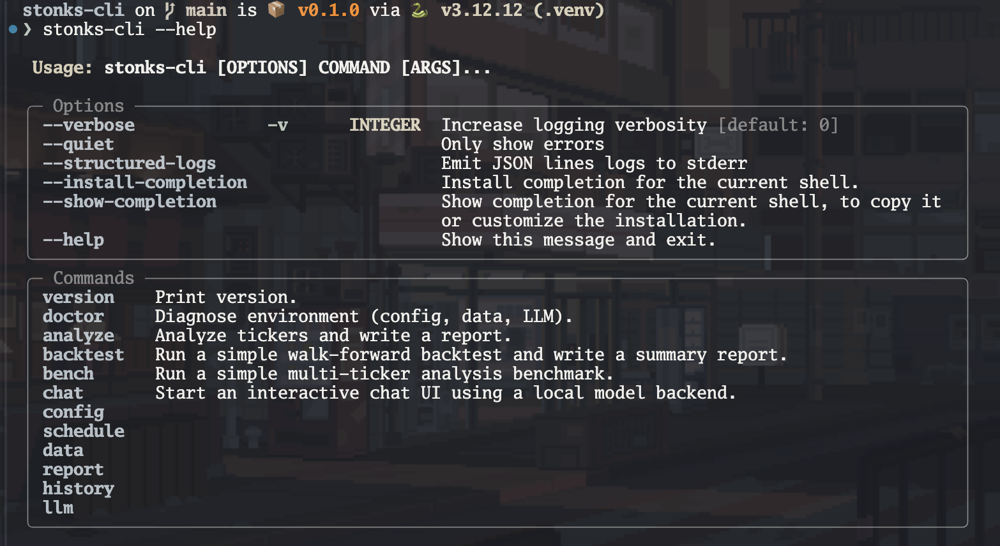
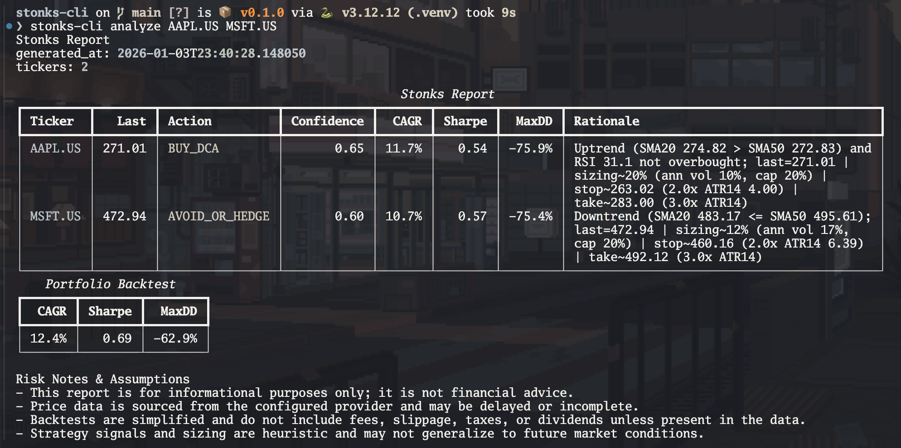
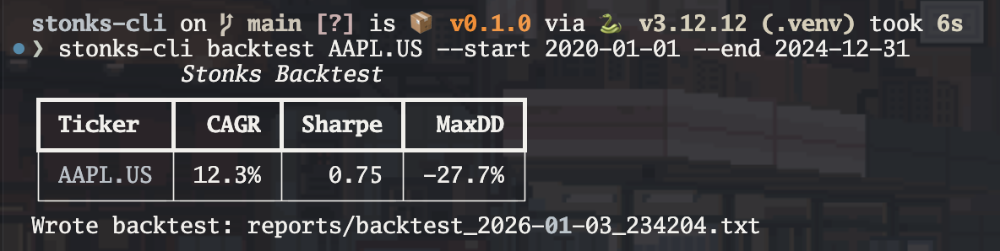

[](https://github.com/gongahkia/stonks-cli/releases/tag/1.0.0)

# `stonks-cli`

Batteries-included Stock Analysis [CLI](https://en.wikipedia.org/wiki/Command-line_interface) tool.

## Stack

* *Backend*: ...  
* *...*: ...  
* *...*: ...  

- Python 3.11+
- CLI: Typer
- Output: Rich tables
- Data/analysis: pandas + numpy
- Scheduling: APScheduler (cron triggers)
- Config: Pydantic v2
- Paths/state/cache dirs: platformdirs
- Providers: Stooq (default), optional yfinance

## Usage

> [!IMPORTANT]  
> Please read the [legal disclaimer](#legal) before using `stonks-cli`.

The below instructions are for locally running `stonks-cli`. Also see [here](#available-commands) for `stonks-cli`'s out-of-the-box commands.

1. First run the below to install `stonks-cli` to your local machine.

```console
$ git clone https://github.com/gongahkia/stonks-cli && cd stonks-cli
$ python3 -m venv .venv && source .venv/bin/activate
$ python3 -m pip install -U pip && python3 -m pip install -e .
```

## Available Commands

```console

```

- `analyze`: compute signals + write report(s)
- `backtest`: walk-forward backtest summary
- `schedule run|once|status`: run on cron or once
- `report open|latest|view`: open/print/view last report
- `history list|show`: inspect prior runs
- `data fetch|verify|cache-info|purge`: provider and cache utilities
- `plugins list`: show configured plugins and discovered strategies/providers
- `watchlist list|set|remove|analyze`: manage named ticker sets
- `signals diff`: compare latest vs previous JSON run

### Sanity check

```bash
stonks-cli --help
stonks-cli version
stonks-cli doctor
```

### Configure
```bash
stonks-cli config init
stonks-cli config where
stonks-cli config show
stonks-cli config validate
```

### Analyze (writes a report)

Analyze one or more tickers and write a text report to `reports/` (default):

```bash
stonks-cli analyze AAPL MSFT
```

Write JSON output alongside the text report:

```bash
stonks-cli analyze AAPL MSFT --json
```

Write a CSV summary alongside the report:

```bash
stonks-cli analyze AAPL MSFT --csv
```

Use a stable filename (overwrites each run):

```bash
stonks-cli analyze AAPL MSFT --name report_latest.txt
```

Change output directory:

```bash
stonks-cli analyze AAPL --out-dir reports
```

### Backtest

```bash
stonks-cli backtest AAPL --start 2020-01-01 --end 2024-12-31
```

### Scheduler

Run once (same as a single scheduled job):

```bash
stonks-cli schedule once
```

Run the scheduler in the foreground:

```bash
stonks-cli schedule run
```

Check scheduler status (cron + next run time):

```bash
stonks-cli schedule status
```

### Reports + history

Print the latest report path:

```bash
stonks-cli report open
```

View the latest report in a pager (interactive) or print (when piped):

```bash
stonks-cli report view
stonks-cli report view | head
```

Print the latest report path and JSON (if available):

```bash
stonks-cli report latest --json
```

List prior runs:

```bash
stonks-cli history list
stonks-cli history show 0
```

Compare latest vs previous run (requires two recorded JSON runs):

```bash
stonks-cli analyze --json --name report_latest.txt
stonks-cli analyze --json --name report_latest.txt --end 2024-04-15
stonks-cli signals diff
```

### Watchlists

Create a named ticker set and analyze it:

```bash
stonks-cli watchlist set tech AAPL MSFT
stonks-cli watchlist list
stonks-cli watchlist analyze tech --json --csv --name report_tech_latest.txt
```

## Screenshots

  
  
  
  
  
  
  

## Architecture

```mermaid
...
```

## Legal

...