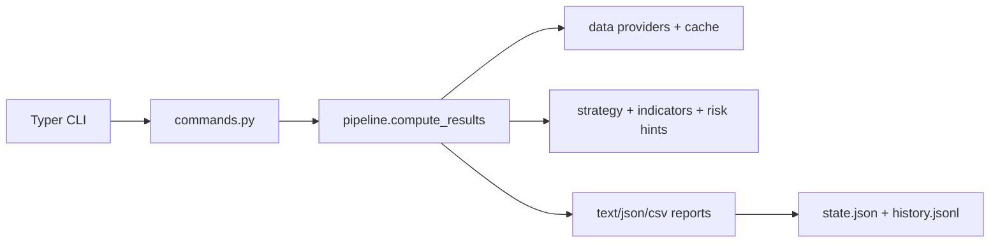

[](https://github.com/gongahkia/stonks-cli/releases/tag/1.0.0)

# `stonks-cli`

A batteries-included stock analysis CLI that writes reports to `reports/`.

## Quickstart

### Prerequisites

- Python 3.11+

### Install (recommended)

Using `pip` (editable install for development):

```bash
python -m venv .venv
source .venv/bin/activate
python -m pip install -U pip
python -m pip install -e .
```

Or using `uv`:

```bash
uv venv
source .venv/bin/activate
uv pip install -e .
```
After installing, the CLI is available as `stonks-cli`.

or invoke the CLI directly:

```bash
./.venv/bin/stonks-cli --help
```

### Sanity check

```bash
stonks-cli --help
stonks-cli version
stonks-cli doctor
```

### Configure
```bash
stonks-cli config init
stonks-cli config where
stonks-cli config show
stonks-cli config validate
```

### Offline demo (recommended for showcasing)

Generate a local OHLCV CSV so you can demo everything without network access:

```bash
python - <<'PY'
import pandas as pd
import numpy as np

np.random.seed(0)
dates = pd.date_range('2024-01-01', periods=180, freq='D')

def make(ticker, base):
	close = base + np.cumsum(np.random.normal(0, 0.3, size=len(dates)))
	return pd.DataFrame({
		'date': dates,
		'open': close,
		'high': close + 0.5,
		'low': close - 0.5,
		'close': close,
		'volume': 1000,
		'ticker': ticker,
	})

df = pd.concat([make('AAPL', 100.0), make('MSFT', 200.0)], ignore_index=True)
df.to_csv('prices.csv', index=False)
print('Wrote prices.csv')
PY

stonks-cli config set data.provider '"csv"'
stonks-cli config set data.csv_path '"./prices.csv"'
stonks-cli config set tickers '["AAPL","MSFT"]'
stonks-cli config validate
```

### Analyze (writes a report)

Analyze one or more tickers and write a text report to `reports/` (default):

```bash
stonks-cli analyze AAPL MSFT
```

Write JSON output alongside the text report:

```bash
stonks-cli analyze AAPL MSFT --json
```

Write a CSV summary alongside the report:

```bash
stonks-cli analyze AAPL MSFT --csv
```

Use a stable filename (overwrites each run):

```bash
stonks-cli analyze AAPL MSFT --name report_latest.txt
```

Change output directory:

```bash
stonks-cli analyze AAPL --out-dir reports
```

### Backtest

```bash
stonks-cli backtest AAPL --start 2020-01-01 --end 2024-12-31
```

### Scheduler

Run once (same as a single scheduled job):

```bash
stonks-cli schedule once
```

Run the scheduler in the foreground:

```bash
stonks-cli schedule run
```

Check scheduler status (cron + next run time):

```bash
stonks-cli schedule status
```

### Reports + history

Print the latest report path:

```bash
stonks-cli report open
```

View the latest report in a pager (interactive) or print (when piped):

```bash
stonks-cli report view
stonks-cli report view | head
```

Print the latest report path and JSON (if available):

```bash
stonks-cli report latest --json
```

List prior runs:

```bash
stonks-cli history list
stonks-cli history show 0
```

Compare latest vs previous run (requires two recorded JSON runs):

```bash
stonks-cli analyze --json --name report_latest.txt
stonks-cli analyze --json --name report_latest.txt --end 2024-04-15
stonks-cli signals diff
```

### Watchlists

Create a named ticker set and analyze it:

```bash
stonks-cli watchlist set tech AAPL MSFT
stonks-cli watchlist list
stonks-cli watchlist analyze tech --json --csv --name report_tech_latest.txt
```

## Stack

- Python 3.11+
- CLI: Typer
- Output: Rich tables
- Data/analysis: pandas + numpy
- Scheduling: APScheduler (cron triggers)
- Config: Pydantic v2
- Paths/state/cache dirs: platformdirs
- Providers: Stooq (default), optional yfinance

## Usage

See **Quickstart** above.

## Available Commands

Run `stonks-cli --help` for the full command list.

## Available Tools

Core commands:

- `analyze`: compute signals + write report(s)
- `backtest`: walk-forward backtest summary
- `schedule run|once|status`: run on cron or once
- `report open|latest|view`: open/print/view last report
- `history list|show`: inspect prior runs
- `data fetch|verify|cache-info|purge`: provider and cache utilities
- `plugins list`: show configured plugins and discovered strategies/providers
- `watchlist list|set|remove|analyze`: manage named ticker sets
- `signals diff`: compare latest vs previous JSON run

Notes:

- If portfolio metrics are available, the report header includes a "Portfolio Backtest" summary.

Optional provider:

- Install yfinance support with `pip install -e ".[yfinance]"` and set `data.provider` to `yfinance`.

## Screenshots

Example (truncated):

```text
Stonks Report
generated_at: 2026-01-04T00:00:00.000000
tickers: 2

┏━━━━━━━━━┳━━━━━━━━┳━━━━━━━━━━━━━━┳━━━━━━━━━━━━┳━━━━━━━┳━━━━━━━━┳━━━━━━━┳━━━━━━━━━━━━━━━━━━━━━━━┳━━━━━━━━━━━━━━━━━━━━━━━━━━━━━━━━━━┓
┃ Ticker  ┃   Last ┃ Action       ┃ Confidence ┃  CAGR ┃ Sharpe ┃ MaxDD ┃ Data                  ┃ Rationale                         ┃
┡━━━━━━━━━╇━━━━━━━━╇━━━━━━━━━━━━━━╇━━━━━━━━━━━━╇━━━━━━━╇━━━━━━━━╇━━━━━━━╇━━━━━━━━━━━━━━━━━━━━━━━╇━━━━━━━━━━━━━━━━━━━━━━━━━━━━━━━━━━┩
┃ AAPL.US ┃  201.3 ┃ BUY_DCA      ┃       0.65 ┃ 12.1% ┃   0.91 ┃ -8.2% ┃ n=500 last=2026-01-03 ┃ Uptrend ...                        ┃
┃ MSFT.US ┃  420.1 ┃ HOLD_WAIT    ┃       0.55 ┃  8.4% ┃   0.62 ┃ -9.7% ┃ n=500 last=2026-01-03 ┃ Uptrend but RSI ...               ┃
└─────────┴────────┴──────────────┴────────────┴───────┴────────┴───────┴───────────────────────┴──────────────────────────────────┘
```

## Architecture



Notes:

- Reports are written to `reports/` by default.
- `state.json` tracks the last run paths; `history.jsonl` stores a newline-delimited log.

## Legal

- This project is for informational/educational use.
- Nothing here is financial advice.
- Market data can be delayed, incomplete, or incorrect.
