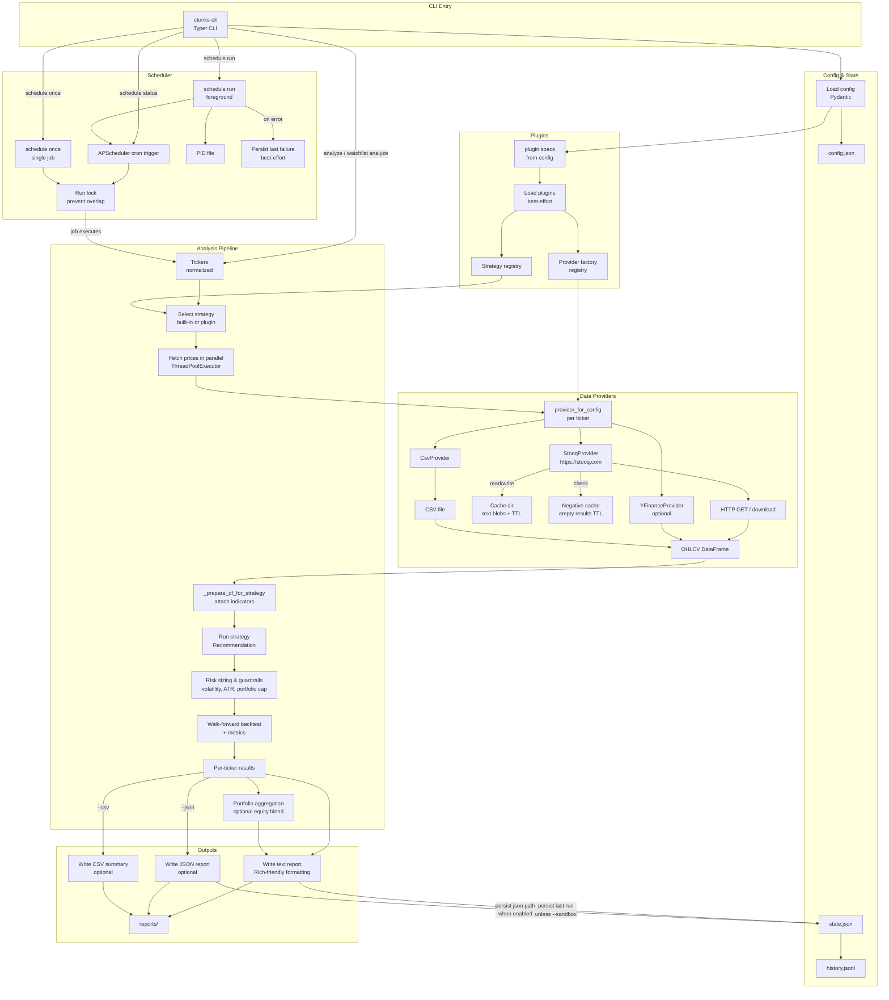

[](https://github.com/gongahkia/stonks-cli/releases/tag/1.0.0)

# `stonks-cli`

A [batteries-included](https://en.wikipedia.org/wiki/Batteries_Included) stock analysis [CLI](https://en.wikipedia.org/wiki/Command-line_interface) tool.

<div align="center">
    
</div>

## Stack

* *Language*: [Python](https://www.python.org) 
* *CLI Framework*: [Typer](https://typer.tiangolo.com)
* *TUI*: [Rich](https://rich.readthedocs.io)
* *Data computation*: [pandas](https://pandas.pydata.org), [NumPy](https://numpy.org)
* *HTTP Client*: [Requests](https://requests.readthedocs.io)
* *Scheduling*: [APScheduler](https://apscheduler.readthedocs.io) 
* *Config*: [Pydantic](https://docs.pydantic.dev/latest/) 
* *Local Paths*: [platformdirs](https://platformdirs.readthedocs.io)
* *Data Providers*: [Stooq](https://stooq.com), [yfinance](https://github.com/ranaroussi/yfinance)
* *Package*: [setuptools](https://setuptools.pypa.io)
* *Dev/QA*: [pytest](https://docs.pytest.org), [ruff](https://docs.astral.sh/ruff/), [mypy](https://mypy.readthedocs.io)

## Usage

> [!IMPORTANT]  
> Please read the [legal disclaimer](#legal) before using `stonks-cli`.

The below instructions are for locally running `stonks-cli`. Also see [here](#available-commands) for `stonks-cli`'s out-of-the-box commands.

1. First run the below to install `stonks-cli` to your local machine.

```console
$ git clone https://github.com/gongahkia/stonks-cli && cd stonks-cli
$ python3 -m venv .venv && source .venv/bin/activate
$ python3 -m pip install -U pip && python3 -m pip install -e .
```

## Available Commands

### Sanity check

```console
$ stonks-cli --help
$ stonks-cli version
$ stonks-cli doctor
```

### Configure

```console
$ stonks-cli config init
$ stonks-cli config where
$ stonks-cli config show
$ stonks-cli config set tickers '["AAPL","MSFT"]'
$ stonks-cli config validate
```

### Analyze 

```console
$ stonks-cli analyze AAPL MSFT # analyse tickers and write textual report to reports/
$ stonks-cli analyze AAPL MSFT --json # write json output alongside text report
$ stonks-cli analyze AAPL MSFT --csv # write csv summary 
$ stonks-cli analyze AAPL --out-dir reports # configure output directory
$ stonks-cli analyze AAPL --start 2020-01-01 --end 2024-12-31
$ stonks-cli analyze AAPL MSFT --name report_latest.txt # stable report filename
$ stonks-cli analyze AAPL MSFT --sandbox # run without persisting last-run history
```

### Backtest

```console
$ stonks-cli backtest AAPL --start 2020-01-01 --end 2024-12-31
$ stonks-cli backtest AAPL MSFT --out-dir reports
```

### Benchmark

```console
$ stonks-cli bench
$ stonks-cli bench AAPL MSFT --iterations 10 --warmup 2
```

### Schedule

```console
$ stonks-cli schedule once
$ stonks-cli schedule run
$ stonks-cli schedule status
$ stonks-cli schedule once --out-dir reports --name report_latest.txt --csv
$ stonks-cli schedule run --out-dir reports --csv
```

### Data

```console
$ stonks-cli data fetch AAPL MSFT
$ stonks-cli data verify AAPL MSFT
$ stonks-cli data cache-info
$ stonks-cli data purge
$ stonks-cli data purge --older-than-days 7
```

### Reports

```console
$ stonks-cli report latest
$ stonks-cli report latest --json
$ stonks-cli report open
$ stonks-cli report view
$ stonks-cli report view reports/report_2026-01-03_234154.txt
```

### History

```console
$ stonks-cli history list
$ stonks-cli history list --limit 50
$ stonks-cli history show 0
```

### Plugins

```console
$ stonks-cli plugins list
```

### Watchlist

```console
$ stonks-cli watchlist set tech AAPL MSFT
$ stonks-cli watchlist list
$ stonks-cli watchlist remove tech
$ stonks-cli watchlist analyze tech --json --csv --name report_tech_latest.txt
```

### Signals

```console
$ stonks-cli signals diff
```

## Screenshots

  
  
  
  
  
  
  

## Architecture



## Legal

`stonks-cli` is provided for educational and informational purposes only.

- **Not financial advice**: This tool does not provide investment, legal, tax, or accounting advice. Any outputs (signals, sizing suggestions, backtests) are heuristic and may be wrong.
- **No warranty**: Use at your own risk. The authors/contributors make no guarantees about correctness, uptime, or fitness for a particular purpose.
- **Data sources & terms**: Market data is fetched from third-party sources (e.g. [Stooq](https://stooq.com) and optional [yfinance](https://github.com/ranaroussi/yfinance) / Yahoo Finance). You are responsible for complying with the applicable terms of service, rate limits, and data-usage restrictions of those providers.
- **Trademarks**: “Yahoo” and “Stooq” are trademarks of their respective owners; this project is not affiliated with or endorsed by them.
- **Local storage**: Reports and run history are written to local disk (e.g. `reports/` plus OS-appropriate app state/cache directories). No intentional data is sent anywhere except to fetch price data from the configured provider.
